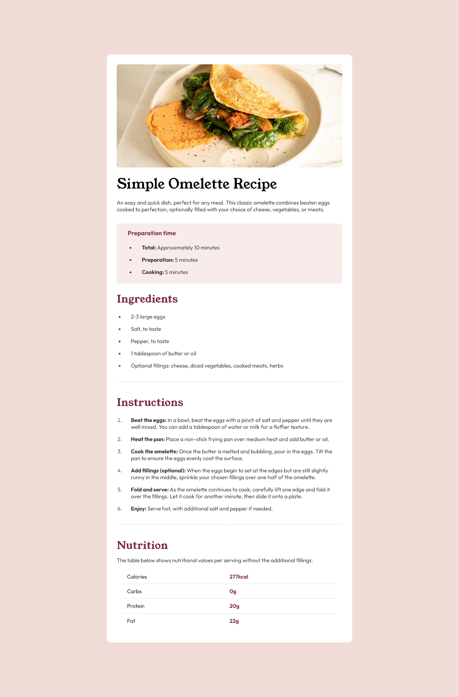

# Frontend Mentor - Recipe page solution

This is a solution to the [Recipe page challenge on Frontend Mentor](https://www.frontendmentor.io/challenges/recipe-page-KiTsR8QQKm). Frontend Mentor challenges help you improve your coding skills by building realistic projects.

## Table of contents

- [Overview](#overview)
  - [The challenge](#the-challenge)
  - [Screenshot](#screenshot)
  - [Links](#links)
- [My process](#my-process)
  - [Built with](#built-with)
  - [What I learned](#what-i-learned)
  - [Continued development](#continued-development)
  - [Useful resources](#useful-resources)
- [Author](#author)
- [Acknowledgments](#acknowledgments)

## Overview

### The challenge

Your challenge is to build out this recipe page and get it looking as close to the design as possible.

You can use any tools you like to help you complete the challenge. So if you've got something you'd like to practice, feel free to give it a go.

### Screenshot



### Links

- Solution URL: [GitHub Repo](https://github.com/CosMo578/Recipe-page)
- Live Site URL: [Vercel Deployment](https://recipe-page-raph.vercel.app)

## My process

### Built with

- Semantic HTML5 markup
- CSS custom properties
- Flexbox
- Desktop-first workflow

### What I learned

I learned how to use the :not pseudo selector to apply styles to multiple elements

```css
section:not(:first-of-type, :last-of-type) {
  padding-bottom: 1.8rem;
}
```
I learned how to set the list style position

```css
ul,
ol {
  list-style-position: outside;
}
```

### Continued development

I want to focus on building responsive, dynamic and accessible website using other technologies like React and TailwindCss in combination with HTML and CSS.


### Useful resources

- [W3Schools List Style Position Tutorial](https://www.w3schools.com/cssref/pr_list-style-position.php) - I was able to style the list items properly because of using this property.

## Author

- Website - [Akpor Raphael](https://raph-portfolio-v2.vercel.app)
- Frontend Mentor - [@CosMo578](https://www.frontendmentor.io/profile/CosMo578)
- Twitter - [@dev_ralph_](https://www.twitter.com/[@dev_ralph_)

## Acknowledgments

I completed this challenge by myself, without the help of anyone. I made use of some resource online and you can find them in the  used some Useful resources section of this readme file.